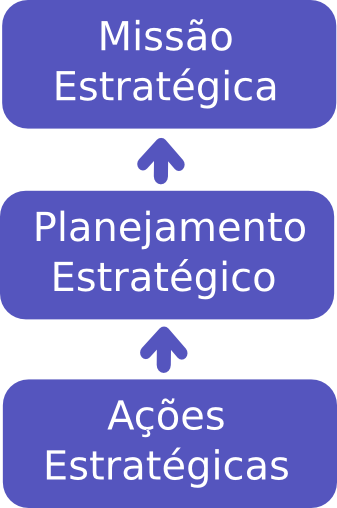

# Anotações:
## Estratégia de Negócios:
### Análise Estrategica:
A apple em um certo momento de sua historia era lucrativa, mas em muitos outros apresentava prejuizos significativos, foi então que a apple fez uma mudança estratégica muito interresante. Ela ampliou os seus horizontes não sendo somente uma empresa de computadores mas também de produtos eletrônicos.  
O que fez uma empresa prestes a falir se torna o sucesso que ela é hoje ? Qual foi a mudança estratégica ?
### O que é estratégica de negócios ?
Estratégia é a sequencia de decisões de uma empresa que determina e revela seus <strong>objetivos,propositos</strong> e <strong>metas</strong>, gera as principais <strong>politicas</strong> e <strong>planos</strong> para alcançar essas metas <strong>e define o escopo de negocio que a empresa deve buscar</strong>, o tipo de organização economica e humana que ela é ou pretende ser, e a natureza de sua cotribuição economica e não-economica. Ela tende a se voltar para seus ancionistas, empregados, clientes e comunidades. (Kenneth Andrews, retirado do livro O conceito de estratégia corporativa)
#### Elementos que formam a estratégia de negócios:
1 - Objetivos, própositos  e metas, a missões de uma empresa. 
2 - A ideia de política e planos para atingir essas metas. 
3 - Escopo, qual é o escopo do nosso negócio ? Qual é a abrangencia de negocio que a companhia deve buscar? 
4 - Valores da empresa, qual é a contribuição que o negócio oferece aos seus acionistas, empregados e demais steakholders? 
#### Um simples esquema estratégico:

